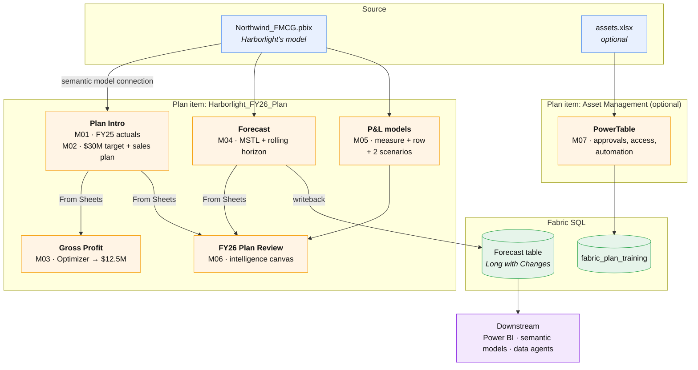
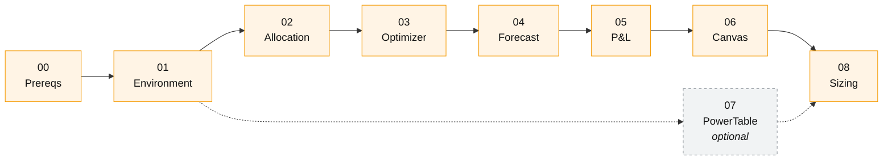

# Lab flow

How the pieces connect, and what each module adds.

## Reading the diagram

**One plan item holds almost everything.** Modules 01 through 06 all build inside
`Harborlight_FY26_Plan`, because a plan item binds permanently to a single semantic
model. Sheets reference each other through **From Sheets**, which is a live link rather
than a copy. Edit the sales plan and the gross profit sheet, the canvas, and every KPI
consuming it all move.

**Writeback is the only exit.** Plan data stays inside the plan item until Module 04
pushes the forecast into a Fabric SQL table. That table is what Power BI, semantic models,
and data agents can read. Writeback does not update the connected semantic model.

**PowerTable is a separate item.** Module 07 stands alone, with its own plan item and its
own SQL database, because it solves a reference-data problem rather than a planning one.

## Module dependencies

Modules 02 through 06 build on each other in order: Module 03 consumes the sales plan
from Module 02, Module 06 visualizes the forecast from Module 04. Module 07 branches off
and can be done any time after the environment exists, or skipped.
